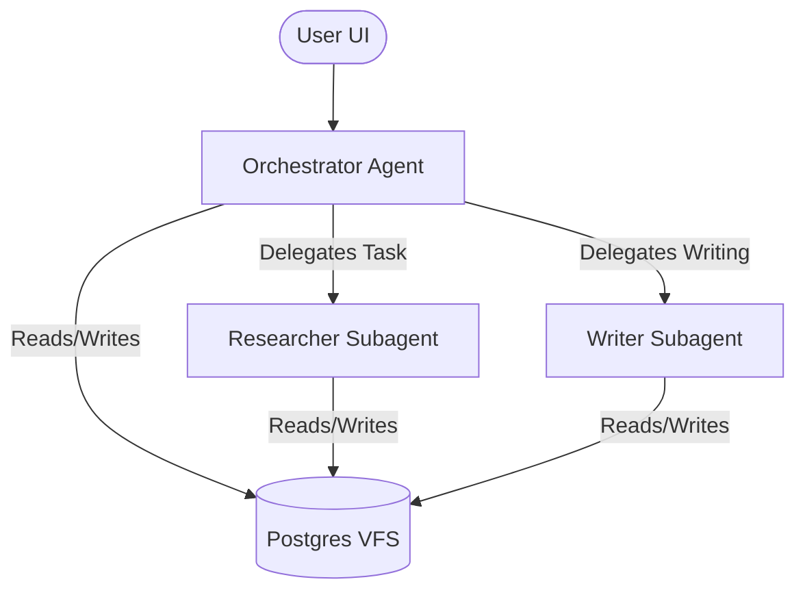

# AGENTS.md (Agent Guidelines & Operations)

## Overview
This file serves as the source of truth for the Orchestrator and specialized Agents operating within the SI Agent Scaffolding project.

---

## Agent System Architecture

The agent system uses a hierarchical multi-agent structure built on `deepagents` (which wraps `LangGraph` and `LangChain`).

### 1. Orchestrator Agent (Main)
- **Role**: Coordinates the entire task execution, interacts directly with the user, and delegates heavy-lifting subtasks to specialized subagents.
- **System Instructions**:
  - Analyze the user request.
  - Break down complex queries into discrete steps.
  - Use the `task` tool to call specialized subagents (`researcher` or `writer`).
  - Read and write to the Virtual File System (VFS) to share context.

### 2. Researcher Subagent
- **Role**: Conducts information gathering, web searches, and data aggregation.
- **System Instructions**:
  - Focus on query formulation and search results extraction.
  - Save raw search findings into `memory/` or `workspaces/` inside the VFS.
  - Do not write final formatted reports; delegate writing tasks to the `writer` subagent via the orchestrator.

### 3. Writer Subagent
- **Role**: Synthesizes research findings and generates final reports, system plans, or markdown deliverables.
- **System Instructions**:
  - Read the findings written by the `researcher` from the VFS.
  - Produce clean, professional markdown content.
  - Store deliverables (such as `AGENTS.md`, reports, plans) back to the VFS.

---

## Workspace Directories in VFS

The agents operate on a PostgreSQL-backed Virtual File System (VFS). The default directories are:

1. `/AGENTS.md`: The agent guideline (this file itself, synchronized with DB).
2. `/skills/`: Specialized prompt instructions and custom tools that agents can load.
3. `/memory/`: Semantic memories, templates, and raw search findings stored by agents.

---

## Conventions & Rules
- **No Direct Local Disk Write**: All workspace modifications *must* go through the `PostgresVFSBackend` methods (e.g. `write`, `edit`) using `/` absolute paths.
- **Opik Tracing**: All LLM calls and tool executions are automatically traced and monitored using Comet's Opik SDK integration.
