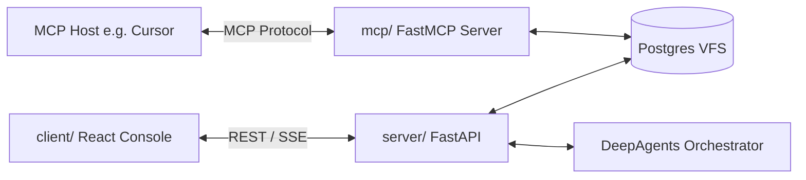

# mcp/DESIGN.md (Model Context Protocol Integration)

## Concept Overview

The Model Context Protocol (MCP) defines a unified specification that lets host applications (Cursor, Claude Desktop, custom agents) access local resources, databases, and custom tools. This directory is a **template for a standalone MCP server** built with [FastMCP](https://gofastmcp.com/).



**Role separation**

| Component | Responsibility |
|-----------|----------------|
| `server/` (FastAPI) | Web UI API, agent streaming (`/api/agent/stream`), VFS REST (`/api/vfs/*`) |
| `mcp/` (FastMCP) | MCP tools/resources/prompts for external MCP hosts |
| Shared backend | Postgres VFS (`server/app/vfs.py`) — same data, different access paths |

Do **not** confuse **FastMCP** (`fastmcp.FastMCP`) with the **FastAPI** web framework used in `server/`. They are separate processes and concerns.

---

## Why FastMCP

[FastMCP](https://pypi.org/project/fastmcp/) is the recommended Python framework for MCP servers in this scaffolding:

- Minimal boilerplate: `@mcp.tool`, `@mcp.resource`, `@mcp.prompt` decorators
- Automatic JSON Schema from type hints and docstrings
- Multiple transports: **stdio** (default, ideal for Cursor), **HTTP**, **SSE**
- Aligns with the project’s Python stack and Postgres VFS

The official low-level `mcp` SDK is available for advanced cases; FastMCP is the default choice here.

---

## MCP Server Capabilities

A custom MCP server in `mcp/` should expose:

1. **Tools** — Callable functions (e.g. `vfs_list`, `vfs_read`, `vfs_write`)
2. **Resources** — URI-addressable data (e.g. `vfs://AGENTS.md`)
3. **Prompts** — Reusable prompt templates (e.g. orchestrator system snippets)

---

## Sample Python MCP Implementation (FastMCP)

Planned layout:

```
mcp/
├── DESIGN.md          # This file
├── pyproject.toml     # fastmcp + shared deps (optional)
└── server.py          # FastMCP entrypoint
```

Example server skeleton:

```python
from fastmcp import FastMCP

# Reuse VFS logic from server (import path TBD when implemented)
# from app.vfs import PostgresVFSBackend

mcp = FastMCP("si-scaffolding-mcp")
# vfs = PostgresVFSBackend()

@mcp.tool
def vfs_list(path: str = "/") -> str:
    """List entries in the Postgres VFS at the given path."""
    # entries = vfs.list(path)
    return "[]"

@mcp.tool
def vfs_read(path: str) -> str:
    """Read file content from the Postgres VFS."""
    # return vfs.read(path)
    return ""

@mcp.resource("vfs://{path}")
def vfs_resource(path: str) -> str:
    """Expose a VFS file as an MCP resource."""
    # return vfs.read(f"/{path}")
    return ""

if __name__ == "__main__":
    mcp.run()  # default: stdio transport
```

### Transport options

| Transport | Use case | How to run |
|-----------|----------|------------|
| **stdio** | Cursor, Claude Desktop, local IDE | `python mcp/server.py` or `fastmcp run mcp/server.py` |
| **HTTP / SSE** | Remote hosts, multiple clients | `mcp.run(transport="http", host="127.0.0.1", port=8001)` |

Keep the MCP server **separate from** the FastAPI process (`server/`, port 8000). Mounting MCP inside FastAPI is possible but not the default for this template.

---

## Cursor / IDE configuration (stdio)

Example `.cursor/mcp.json` (paths adjusted to your environment):

```json
{
  "mcpServers": {
    "si-scaffolding": {
      "command": "uv",
      "args": ["run", "python", "mcp/server.py"],
      "cwd": "/path/to/agent-template"
    }
  }
}
```

Ensure `DATABASE_URL` (or equivalent) matches `server/.env` so the MCP server reads the same Postgres VFS.

---

## Integration with DeepAgents (`server/`)

The web orchestrator (`server/app/agent.py`) currently uses LangChain `@tool` and VFS via `PostgresVFSBackend`, **not** MCP.

To let the in-process agent call MCP tools later:

1. Run or connect to this FastMCP server (stdio or HTTP).
2. Bridge with a LangChain MCP adapter (e.g. `langchain-mcp-adapters`) inside `server/app/agent.py`.

That bridge is **out of scope** for `mcp/DESIGN.md`; this directory only defines the MCP server side.

---

## Dependencies (when implemented)

Add to `mcp/pyproject.toml` (or extend the workspace root):

```toml
dependencies = [
    "fastmcp>=2.0.0",
    # shared with server: pydantic, psycopg, etc.
]
```

---

## References

- [FastMCP documentation](https://gofastmcp.com/)
- [Model Context Protocol specification](https://modelcontextprotocol.io/)
